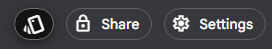
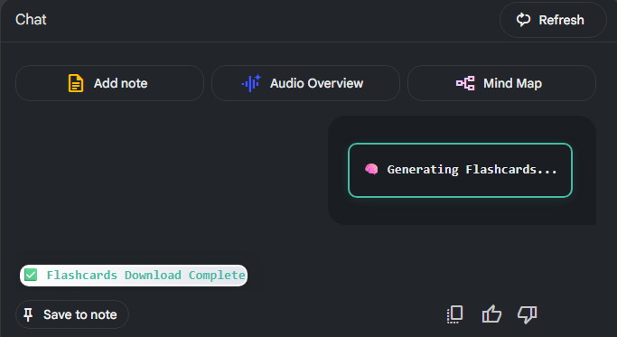
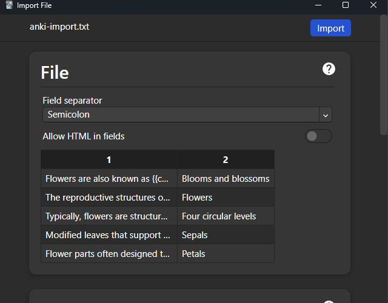

# Notebooklm flashcards extension

A Chrome Extension for NotebookLM that generates high-quality flashcards from your notes, optimized for Anki import.

Note: this readme is AI generated 💀

## The more sources, the longer it will load! Be warned.

## Features

- Adds a "Generate Flashcards" button to NotebookLM.
- Automatically formats flashcards in `"Front";"Back"` style, one fact per card.
- Downloads flashcards as a text file ready for Anki import.
- Ensures clean output with no extra formatting or explanations.

## Screenshots

**This plugin adds a new button:**

**Tracking in chat of progress:**

**Easy to import in Anki or other flashcard apps:**

## Installation

1. Clone or download this repository.
2. In Chrome, go to `chrome://extensions/`.
3. Enable "Developer mode" (top right).
4. Click "Load unpacked" and select the repository folder.

## Usage

1. Open NotebookLM in Chrome.
2. Click the "Generate Flashcards" button (next to the Share button).
3. Wait for the flashcards to be generated.
4. Download the flashcards file and import it into Anki.

## Troubleshooting

- If the button does not appear, reload the NotebookLM page.
- If no flashcards are generated, ensure your notes are visible and properly formatted.
- For interface changes, update selectors in `content.js`.

## License

MIT License
